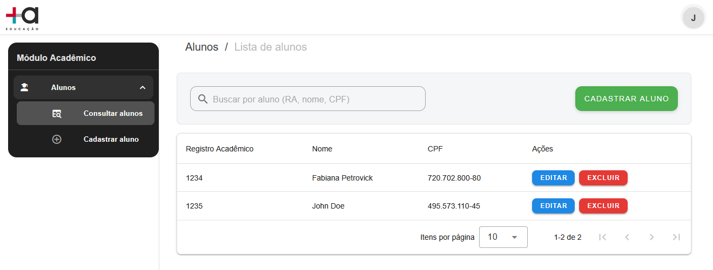
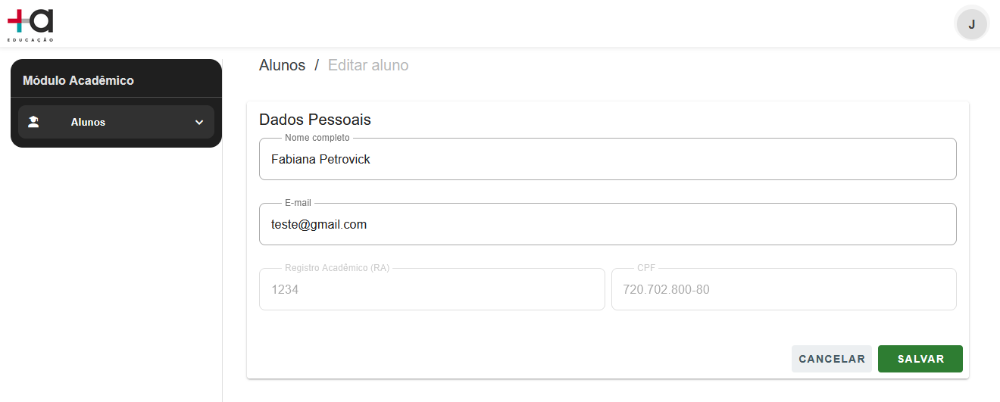
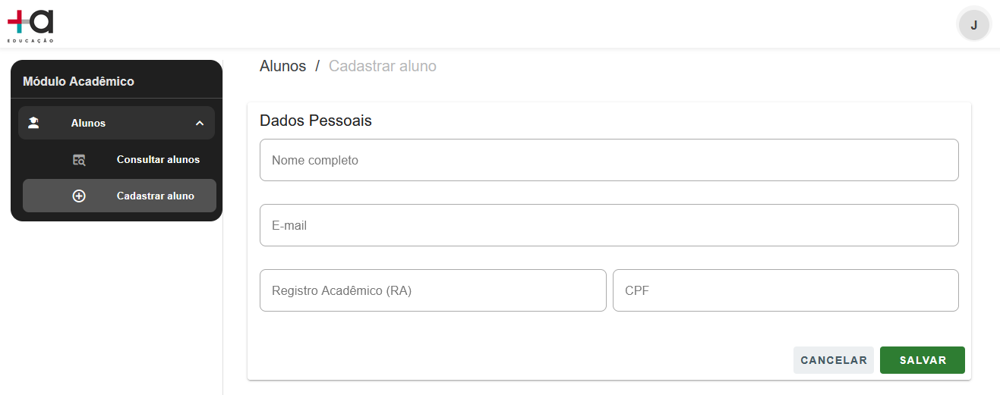

## Front-end (Vue 3 + Vuetify)

Aplicação web para gestão de alunos (listagem, busca, criação/edição e remoção), construída em Vue 3 + TypeScript, Vuetify e Vite. O projeto segue organização por módulos (Students) e usa Pinia para estado, vue-router para rotas e Axios para integração com a API.

Há um .env.example para configuração local e um COMMENTS.md com observações do desafio. 
 
## Stack

- Vue 3 + TypeScript
- Vuetify (UI) + @mdi/font (ícones)
- Vite (dev server / bundler)
- Pinia (estado) e vue-router (rotas)
- Axios (HTTP)
- O repositório é majoritariamente Vue/TS.

## Pré-requisitos

- Node.js 20.x ou 22.x
- npm
- Make para usar o atalho make run-all

## Configuração

1. Clone o repositório e instale dependências:
``` 
npm install
```
2. Copie o arquivo de exemplo de variáveis:
- cp .env.example .env
3. Edite .env conforme sua API (ex.: VITE_API_BASE_URL).

## Como rodar
### Opção A — com Make (recomendado)
Atalho que prepara o ambiente e sobe o app:
```
make run-all
```
### Opção B — manual
```
npm run dev
```

## Imagens da aplicação

<table>
  <tr>
    <td></td>
    <td></td>
    <td></td>

  </tr>
  <tr>
    <td align="Listagem"><em>Listagem</em></td>
    <td align="Editar"><em>Editar</em></td>
    <td align="Cadastrar"><em>Cadastrar</em></td>
  </tr>
</table>


